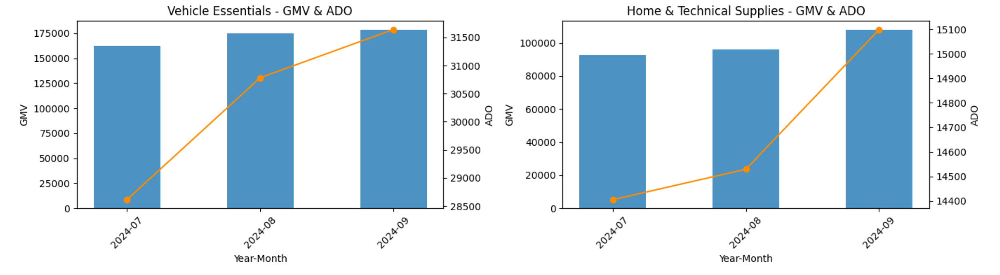
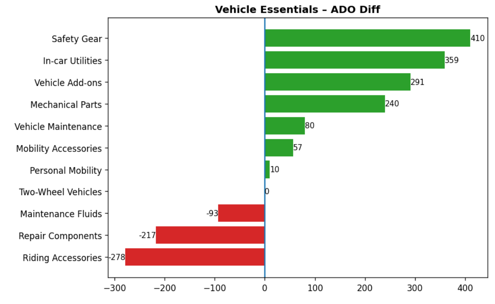
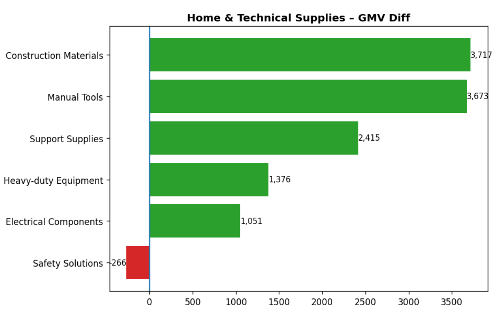

# Quick Category Performance Diagnosis Framework (MoM)

## 1. Tổng quan dự án

Dự án xây dựng một framework phân tích hiệu quả ngành hàng theo Month-over-Month (MoM) nhằm hỗ trợ team:

- Hiểu bản chất tăng trưởng (volume hay value-driven)

- Xác định chính xác động lực tăng/giảm

- Phát hiện sớm rủi ro cấu trúc

- Chuẩn hóa quy trình review hiệu suất hàng tháng

Thay vì chỉ báo cáo % tăng trưởng, framework tập trung vào phân tích tăng trưởng và đánh giá chất lượng tăng trưởng, giúp việc ra quyết định dựa trên cấu trúc dữ liệu thay vì cảm tính.

Framework được thiết kế để tái sử dụng:

Khi có dữ liệu tháng mới, chỉ cần cập nhật input, toàn bộ pipeline và logic phân tích vẫn giữ nguyên.

## 2. Dataset 

Dataset gồm:
- 3 tháng dữ liệu
- 2 LV1 chính
- 20+ LV2
- ~300.000 product record

## 3. Tech stack
- SQL (Data cleaning & aggregation)
- Google Colab (Pandas, Numpy, Matplotlib)

## 4. Bài toán kinh doanh

Khi kết thúc tháng, các câu hỏi thực tế từ business bao gồm:

- Vì sao ADO/AdGMV tăng hoặc giảm?

- Ngành hàng cấp 2 nào đang đóng góp chính?

- Tăng trưởng có tập trung vào một vài nhóm nhỏ không?

- Có ngành hàng lớn nào đang suy giảm ngầm nhưng chưa thể hiện rõ ở tổng thể?

- Xu hướng này là ngắn hạn hay có tính liên tục?

Framework được xây dựng để trả lời các câu hỏi trên theo cấu trúc rõ ràng:

Tổng quan → Động lực → Chất lượng → Xu hướng 

## 4. Phương pháp phân tích

### 4.1 Phân tích tăng trưởng theo cấu trúc

Phân tích theo mô hình drill-down:

Ngành hàng Level 1 → Ngành hàng Level 2 → nhóm sản phẩm (đã chuẩn hóa)

Tại mỗi cấp độ, tính:

    Diff (Current – Previous)

    MoM %

    Tỷ trọng đóng góp vào tổng tăng trưởng

Mục tiêu:

Không chỉ biết ngành tăng/giảm bao nhiêu %, mà biết tăng do ai và mức độ phụ thuộc cao hay thấp.

### 4.2 Đánh giá chất lượng tăng trưởng

Kết hợp hai yếu tố:

    Diff_ado/ Diff_gmv

    Tỷ trọng cấu trúc ADO/AdGMV

Phân loại LV2:

- Share lớn + tăng trưởng → Trụ cột tăng trưởng

- Share lớn + suy giảm → Rủi ro cấu trúc

- Share nhỏ + tăng trưởng → Cơ hội phát triển


Cách tiếp cận này giúp ưu tiên hành động thay vì chỉ nhìn vào tăng trưởng tuyệt đối.

### 4.3 Chuẩn hóa và gom nhóm sản phẩm

Dữ liệu gốc có tình trạng phân mảnh tên sản phẩm.

Giải pháp:

- Chuẩn hóa text

- Loại bỏ từ nhiễu

- Giữ lại 5 từ khóa chính

- Nhóm theo từ khóa sản phẩm 

Mục tiêu:

- Giảm nhiễu phân tích

- Tránh đếm lặp sản phẩm cùng bản chất

- Phản ánh đúng hành vi tiêu dùng

### 4.4 Phát hiện xu hướng và rủi ro sớm

Xây dựng logic cảnh báo:

- LV2 giảm liên tiếp ≥ 2 tháng

- Sản phẩm giảm liên tiếp + mức giảm lớn + share cao

Điều này giúp phát hiện sớm các nhóm có nguy cơ ảnh hưởng đến GMV tổng trước khi biểu hiện rõ ở cấp LV1.

4.5. Data & Validation

Cấp độ phân tích:

- LV1: Ngành hàng cấp 1 

- LV2: Ngành hàng cấp 2 

- Nhóm sản phẩm (chuẩn hóa từ tên sản phẩm)

Chỉ số chính:

- ADO (Average Daily Orders)

- AdGMV (Average Daily GMV)

Trước khi tính MoM:

- Chuẩn hóa định dạng dữ liệu

- Loại bỏ giá trị bất thường ảnh hưởng đến tăng trưởng

Mục tiêu: đảm bảo MoM phản ánh thay đổi thực tế, không bị méo bởi lỗi dữ liệu.

## 5. Pipeline xử lý dữ liệu

SQL Layer

- Union dữ liệu nhiều tháng

- Chuẩn hóa định dạng

- Tạo trường year_month

- Aggregate theo LV2 và Product

- Tính MoM bằng window function LAG()

Output: Dataset sạch, có data dữ liệu kỳ trước, phục vụ cho phân tích dữ liệu sau nay.

File: cat_pfm_pipeline.sql

Python Layer

- Xử lý text sản phẩm

- Tính tỷ trọng tăng trưởng và tỷ trọng ADO/AdGMV

- Phân loại chất lượng tăng trưởng

- Xây dựng logic cảnh báo xu hướng

- Trực quan hóa phục vụ storytelling

Notebook:

[01_overview](notebooks/01_overview.ipynb)

[02_product_keyword](notebooks/02_product_keyword.ipynb)

[03_growth_driver](notebooks/03_growth_driver.ipynb)

[04_quality_growth](notebooks/04_quality_growth.ipynb)

[05_trend](notebooks/05_trend.ipynb)

## 6. Ví dụ Insight thực tế

Tháng 9:

Hai ngành Vehicle Essentials và Home & Technical Supplies tăng +6.71% ADO và +14.64% GMV MoM



Tuy nhiên, cấu trúc tăng trưởng khác nhau:

- Vehicle Essentials tăng trưởng theo số lượng đơn hàng , phụ thuộc vào 3 top LV2 chính (đóng góp >100% mức tăng ròng)

→ tăng trưởng tập trung, rủi ro phụ thuộc cao.



Home & Technical Supplies tăng trưởng theo giá trị đơn hàng, 3 top LV2 đóng góp ~81.9% 

→ cấu trúc lan tỏa và ổn định hơn.



Ngoài ra:

- Một số LV2 có tỷ trọng ADO/AdGMV lớn nhưng giảm liên tiếp → cảnh báo rủi ro cấu trúc

- Một số nhóm tăng liên tiếp ≥ 2 tháng → tín hiệu tăng trưởng bền vững

Kết luận:

- Cùng là tăng trưởng, nhưng mức độ ổn định và mức độ phụ thuộc cấu trúc khác nhau → cần chiến lược vận hành khác nhau.

## 7. Impact đạt được

- Giảm thời gian chuẩn bị báo cáo từ ~40 phút xuống 10–15 phút

- Chuẩn hóa logic phân tích → giảm sai sót thủ công

- Hỗ trợ xác định sớm nhóm ngành có rủi ro cấu trúc

- Tạo framework tái sử dụng cho các kỳ tiếp theo

- Nâng cấp báo cáo từ “mô tả số liệu” sang “giải thích bản chất tăng trưởng”

## 8. CẤU TRÚC REPOSITORY
```text
quick-category-performance-report/
│
├── README.md
├── sql/
│   └── cat_pfm_pipeline.sql
│
├── notebooks/
│   ├── 01_overview.ipynb
│   ├── 02_product_keyword.ipynb
│   ├── 03_growth_driver.ipynb
│   ├── 04_quality_growth.ipynb
│   ├── 05_trend.ipynb
│   └── cat_quick_report.ipynb
│
└── src/
    ├── load_data.py
    ├── metrics.py
    └── charts.py

```
## 9.Báo cáo đầu ra 
Đây là phiên bản báo cáo tổng hợp cuối cùng sau quá trình xử lý và phân tích dữ liệu

[BÁO CÁO CHI TIẾT](https://vannguyenhoai43-hash.github.io/ecommerce-category-growth-analysis/report_cat.html)


