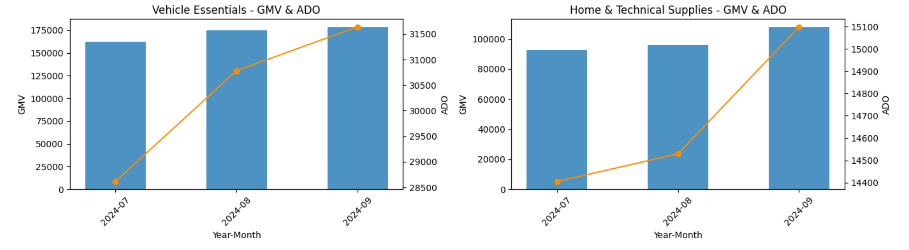
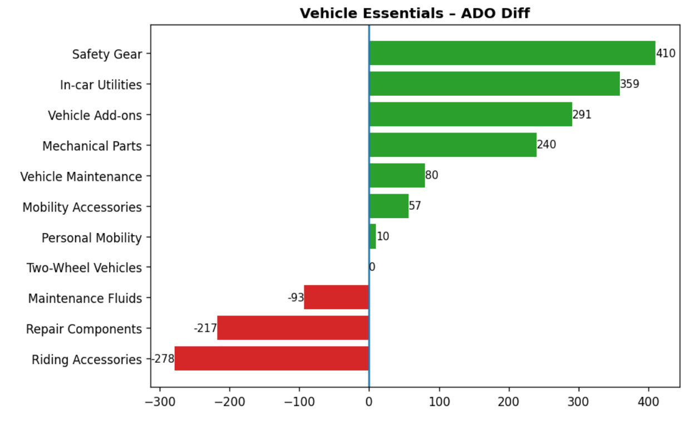
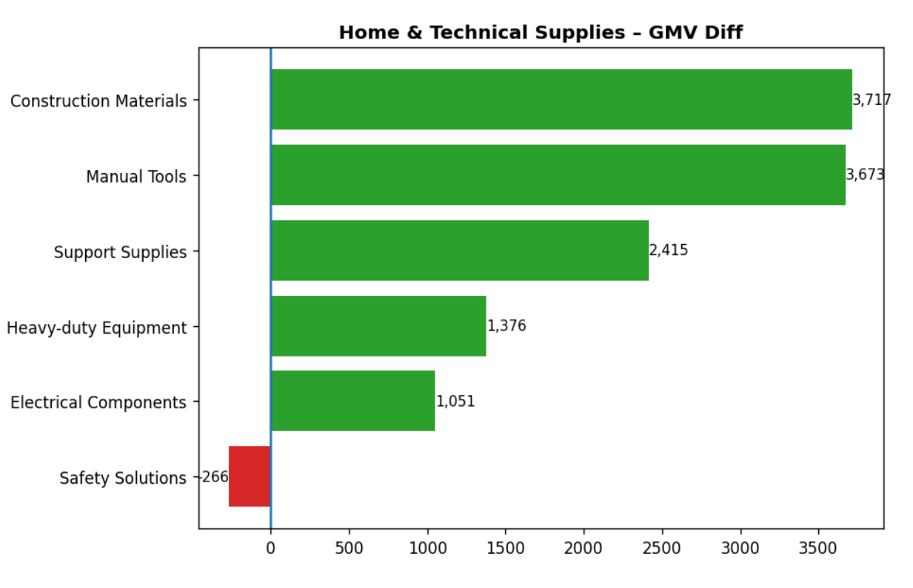

# Quick Category Performance Diagnosis Framework (MoM)

🌐 Read this in: **English** | [Tiếng Việt](README_VI.md)

# E-commerce Category Growth Diagnosis

## Project Overview

**Topline MoM growth is a weak signal** when a team has to review **20+ small categories** in a short time. It shows **what changed**, but not **what drove the change, whether the growth is structurally healthy, or which groups deserve action next**.

This project builds an **end-of-period category growth diagnosis report** for e-commerce review. Using **SQL** and **Python**, I analyzed performance from **LV2 to product level** across three layers: **Growth Driver, Growth Quality, and Growth Trend**. The output is a **decision-support report** designed for fast category review, not just descriptive reporting. 

---

## Dataset

The project uses the most recent **3 months of data**, including:

- **2 LV1 categories**
- **20+ LV2 categories**
- around **500,000 item-level rows**

Main KPIs:

- **ADO**
- **GMV**

> **Note:** MoM compares the current month with the previous month.  
> **Trend** is currently tracked as a **2-month consecutive signal** within the available data window. 

---

## What I Did

- Cleaned and consolidated multi-month data using **SQL**
- Standardized data for period-over-period comparison
- Processed **item names** to group similar products under the same product group
- Drilled down growth from **LV2 to product level**
- Evaluated growth across **driver, quality, and trend**
- Summarized results into a reusable **end-of-period review report** 

---

## Analytical Framework

### 1. Growth Driver

Identify which **LV2 groups** and **product groups** contribute most to category growth or decline.

**Key metrics**
- **Diff**
- **MoM %**
- **Contribution to Total Growth**

This layer answers:
- which groups are driving growth
- which groups are dragging performance
- whether growth is overly dependent on a few major clusters 

Detail: [growth_driver](notebooks/03_growth_driver.ipynb)

### 2. Growth Quality

Growth quality is not defined by positive growth alone. It is evaluated by combining:

- **Diff ADO / Diff GMV**
- **ADO Weight / GMV Weight**
- **share change by LV2**

This helps distinguish between:

- **Large weight + Growth** → core growth drivers  
- **Small weight + Growth** → emerging opportunities  
- **Large weight + Decline** → structural risk groups  

It also helps flag cases where **volume growth and value growth move differently**, which signals uneven growth quality across groups. 

Detail: [quality_growth](notebooks/04_quality_growth.ipynb)

### 3. Growth Trend

Track short-term momentum and early warning signals.

**Focus areas**
- groups growing for **2 consecutive months**
- groups declining for **2 consecutive months**
- high-weight groups showing significant decline

This layer is used as an **early warning signal** for end-of-period review. 

Detail: [trend](notebooks/05_trend.ipynb)

---

## Product Grouping Logic

Raw item names are often inconsistent, which makes product-level analysis fragmented and noisy.

To improve this, I built a **keyword-based grouping logic** by:

- standardizing text
- removing noise words
- extracting core keywords
- grouping items by dominant keyword pattern

This helps:

- reduce analytical noise
- avoid double-counting similar products
- reveal the real product groups driving category growth

This step pushes the analysis closer to the **root driver at product level**, instead of stopping at category-level movement. 

Detail:[product_keyword](notebooks/02_product_keyword.ipynb)

---

## Key Insights

- In **September**, both **Vehicle Essentials** and **Home & Technical Supplies** grew, but the structure behind that growth was very different. 



- **Vehicle Essentials** showed **high growth concentration**. Its ADO growth was mainly driven by **Safety Gear, In-car Utilities, and Vehicle Add-ons**, contributing **123.4%** of total ADO growth. On GMV, **Personal Mobility, In-car Utilities, and Vehicle Add-ons** contributed **272.8%** of total GMV growth. This points to **positive topline growth with high dependency risk**.
- 

- **Home & Technical Supplies** also grew, but with a **more balanced contribution structure**. Its GMV growth was mainly driven by **Construction Materials, Manual Tools, and Support Supplies**, contributing **81.9%** of total growth, suggesting a **more stable growth profile**. 


- Growth quality becomes more actionable when size is considered. In **Vehicle Essentials**, **Safety Gear** and **In-car Utilities** were meaningful high-weight growers, while **Riding Accessories** and **Repair Components** remained large but declined. In **Home & Technical Supplies**, **Support Supplies** and **Manual Tools** stood out as strong growers, while **Heavy-duty Equipment** was a high-weight declining group. 

- Smaller groups such as **Mechanical Parts, Vehicle Add-ons, Personal Mobility**, and **Construction Materials** grew strongly despite lower weight, making them better viewed as **watchlist opportunities** than immediate core drivers. 

> **Main takeaway:** categories with similar topline growth can have very different **growth concentration, quality, and risk profile** — which leads to different action priorities. 

---

## Scope & Limitation

This project is designed for **quick end-of-period diagnosis**, not long-horizon forecasting or full root-cause analysis.

Because the current data window covers **3 months**, the **trend layer** should be read as an **early signal**, not a long-term conclusion. The framework is meant to support prioritization, with room to become stronger as more historical data is added. 

---

## Deliverables

- **SQL pipeline** for data cleaning and consolidation
- **Colab notebooks** for each analysis module
- **Charts** for quick category review
- **End-of-period category growth report** 

---

## Repository Structure

```text
ecommerce-category-growth-analysis/
├── README.md
├── sql/
│   └── cat_pfm_pipeline.sql
├── notebooks/
│   ├── 01_overview.ipynb
│   ├── 02_product_keyword.ipynb
│   ├── 03_growth_driver.ipynb
│   ├── 04_quality_growth.ipynb
│   ├── 05_trend.ipynb
│   └── cat_quick_report.ipynb
├── src/
│   ├── load_data.py
│   ├── metrics.py
│   └── charts.py
└── report_cat.html

